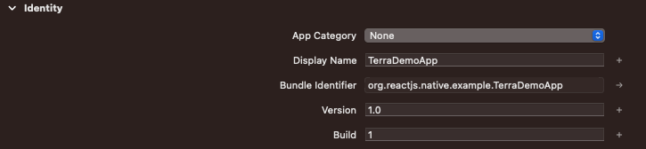
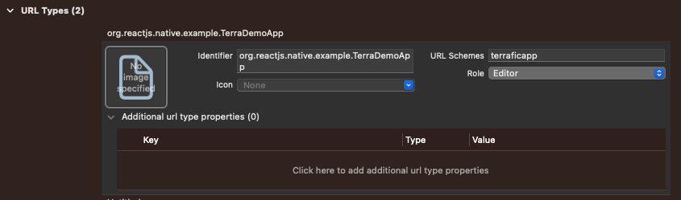

# Terra Demo App - React Native Framework

The Terra Demo App is a React Native demo app repository that provides a good starting point for integrating your app with the Terra service. The app showcases how to authenticate users, request health data through Terra series, and use the Terra service effectively.
## Requirements

This project was initially tested using iOS development. If you have never used React Native before, you can follow the steps in the following link to set up your React Native iOS environment (base React Native setup, not Expo): https://reactnative.dev/docs/environment-setup. By following the instructions in the link, you will have the following dependencies installed:
- React Native version (Version **0.69**)
- Node & Watchman
- Ruby (Version **2.7.6**)
- Xcode (for iOS development)
- CocoaPods
- React Native Command Line Interface


## React Native Library Installation and Start running

1. Clone the repository:
```bash
git clone https://github.com/username/repo.git
```
2. Install the dependencies:
```bash
cd repo
npm install
```
3. To set up a URL scheme in Xcode for your React Native app, follow the instructions in this link: https://reactnative.dev/docs/linking. 
Specifically, set the URL scheme to "terraficapp" and the identifier to your project's Bundle Identifier, which can be found at identity > Bundle Identifier.


4. Check if Apple Health Integration Setup for iOS is already setup by checking
- two privacy to Info-list: 
Open your Xcode project and select your project in the project navigator.
Select your target from the targets list.
Click on the Info tab.
Check if "Privacy - Health Share Usage Description" and "Privacy - Health Record Usage Description" are there in the list under the "Custom iOS Target Properties" section.
Check if the capability for clinical health records and background delivery in Xcode under the HealthKit Capability is enabled. (https://developer.apple.com/documentation/xcode/adding-capabilities-to-your-app)
Refer to this link to understand why this setup is necessary: https://docs.tryterra.co/docs/react-native-project

4. Linking in react-native:
Detail: https://guides.cocoapods.org/using/pod-install-vs-update.html
```bash
cd ios
pod install
cd ..
```
5. Now you are good to go! npm start!
```bash
npx react-native start
npx react-native run-ios
```

